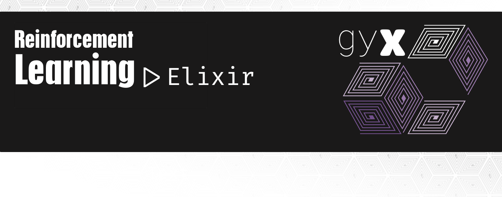

# Gyx

Native Elixir reinforcement learning. Environments follow a
Gymnasium-shaped contract (`make` / `reset` / `step` / `render`) and
trainers stay on the BEAM. Drive them from IEx, the Mix CLI, or the
optional playground.

This repository is three layers:

| Layer | Where | Shipped with Hex? |
| --- | --- | --- |
| **Library** | `lib/`, `priv/` | yes |
| **CLI** | `mix gyx.*` | yes (Mix tasks in the library) |
| **Playground** | `ui/` | no — separate Phoenix app |

The library does not depend on Phoenix. The UI depends on Gyx
(`{:gyx, path: ".."}`) and only talks to it through `Gyx.Session` and
`Gyx.Experiment`. The old OpenAI Gym `erlport` stack is under `legacy/`
and is not compiled.

Gymnasium interaction for CSHRL synthesis lives in
[synthex](https://github.com/doctorcorral/synthex). Gyx can score a
couple of classic envs without starting Python; see [Synthex](#synthex).

## Requirements

* Elixir `~> 1.15` and Mix
* [Nx](https://github.com/elixir-nx/nx) `~> 0.9`, [EXLA](https://github.com/elixir-nx/nx/tree/main/exla) `~> 0.9`, [Axon](https://github.com/elixir-nx/axon) `~> 0.7` (pulled in by `mix deps.get`)
* A working XLA/EXLA host toolchain for the default Farama MuJoCo path

Optional:

* `python3` + `gymnasium` + `mujoco` — `gymnasium/*` MuJoCo C wraps and `mix gyx.bench`
* `python3` + `gymnasium` + `ale-py` + ALE ROMs — `gymnasium/ALE/*` Atari
* [synthex](https://github.com/doctorcorral/synthex) — fetched from GitHub in `:dev` / `:test` only (`mix gyx.synthex`). Not a Hex package dependency.

Classic control, Blackjack, FrozenLake, and the approximate `tree/`
suite run with no Python.

## Install

```elixir
# mix.exs
{:gyx, "~> 0.3.0"}
```

From this repo:

```bash
mix deps.get
mix test
```

The Hex package includes `lib`, `priv` (MJCF assets, the Python
bridge, static images), `images`, `config`, and Mix tasks. It does
**not** include `ui/` or `legacy/`.

## Quick start

```elixir
{:ok, env} = Gyx.make("CartPole-v1")
{env, obs, info} = Gyx.reset(env, seed: 0)
{:ok, env, exp} = Gyx.step(env, 1)

exp.next_observation
exp.reward
exp.terminated
exp.truncated
exp.info
```

`exp` is a `Gyx.Core.Exp`: one transition `{observation, action,
next_observation, reward, terminated, truncated, info}`. The episode is
done when `terminated or truncated` (`Gyx.Core.Exp.done?/1`).

```elixir
Gyx.envs()
Gyx.spec("CartPole-v1")
Gyx.observe(env)
Gyx.params(env)
{:ok, svg} = Gyx.render(env, :svg)
```

Pass `server: true` to `Gyx.make/2` to wrap the struct in a
`Gyx.Env.Server` process (named, shareable — what a LiveView would
use). `Gyx.reset/2`, `step/2`, `observe/1`, and `render/2` accept either
a struct or a pid.

## Environments

`Gyx.make/2` looks up a registered id. The **environment** is
`Hopper-v4`; a prefix names the **implementation**.

| Prefix | Example | Engine | Python? |
| --- | --- | --- | --- |
| *(none)* | `Hopper-v4` | Official Farama MJCF + `Gyx.Physics.Mj` (Nx/EXLA) | no |
| `tree/` | `tree/Hopper-v4` | Approximate `Gyx.Physics.Tree` | no |
| `gymnasium/` | `gymnasium/Hopper-v4` | Real MuJoCo C via a Python Port | yes |
| `gymnasium/ALE/` | `gymnasium/ALE/Pong-v5` | ALE/Stella via the same Port | yes |

Unprefixed Farama ids aim at the same observation and reward contract
as `gymnasium.make("Hopper-v4")`. Gold checks live in
`test/envs/farama_test.exs` — those tolerances are the guarantee, not
the Python wrap.

The first step of each body/dof shape compiles an XLA kernel (a few
seconds). Later steps reuse it. Set `config :gyx, :mj_backend, :elixir`
to use the scalar BEAM integrator instead of EXLA.

Short aliases work for the classics (`:cartpole`, `"cartpole"`,
`"CartPole-v0"` → `CartPole-v1`).

### Classic control and toys

All native Elixir. Discrete or 1-D `Box` observations as float tuples.

| Id | Observation | Action | Notes |
| --- | --- | --- | --- |
| `CartPole-v1` | `{x, x_dot, theta, theta_dot}` | `0` / `1` | truncates at 500 |
| `MountainCar-v0` | `{position, velocity}` | `0` / `1` / `2` |  |
| `Acrobot-v1` | 6-D link kinematics | `0` / `1` / `2` |  |
| `Pendulum-v1` | `{cos θ, sin θ, θdot}` | torque `Box` | trainers discretize to `-2 / 0 / +2` |
| `FrozenLake-v1` | tile index `0..n-1` | `0..3` | `is_slippery`, `map_name` `"4x4"` / `"8x8"` |
| `Blackjack-v1` | `{player, dealer, usable_ace}` | stick / hit |  |

```elixir
{:ok, env} = Gyx.make("FrozenLake-v1", is_slippery: false, map_name: "8x8")
env = Gyx.configure(env, is_slippery: true)
Gyx.params(env)
# => [%{key: :is_slippery, ...}, %{key: :map_name, ...}]
```

### Farama MuJoCo (unprefixed)

Official XML from `priv/mjcf/` (Apache-2.0, vendored from Gymnasium)
plus the native rigid-body engine. Observation is a float tuple;
action is a float tuple sized to the actuator count.

| Id | obs | act | episode cap |
| --- | --- | --- | --- |
| `InvertedPendulum-v4` | 4 | 1 | 1000 |
| `InvertedDoublePendulum-v4` | 11 | 1 | 1000 |
| `Reacher-v4` | 11 | 2 | 50 |
| `Swimmer-v4` | 8 | 2 | 1000 |
| `Hopper-v4` | 11 | 3 | 1000 |
| `Walker2d-v4` | 17 | 6 | 1000 |
| `HalfCheetah-v4` | 17 | 6 | 1000 |
| `Ant-v4` | 27 | 8 | 1000 |

```elixir
{:ok, env} = Gyx.make("Hopper-v4")
{env, obs, info} = Gyx.reset(env, seed: 0)
{:ok, env, exp} = Gyx.step(env, {0.1, 0.0, -0.1})
```

### Tree (approximate)

Same body names under `tree/…`. Faster to hack on. **Not** a physics
clone of Farama — do not treat `tree/Hopper-v4` as transfer-equivalent
to `Hopper-v4`.

### Gymnasium wrap (Python)

`gymnasium/Hopper-v4` and `gymnasium/Hopper-v5` (and the rest of the
Farama locomotion suite, v4 and v5) start a long-lived Port
(`priv/python/gymnasium_bridge.py`) that owns a real
`gymnasium.make` env. Use this to evaluate a Gyx policy on the C
engine, or to bench against it.

Requires `python3` with `gymnasium` and `mujoco`. If those are
missing, `Gyx.make("gymnasium/Hopper-v4")` fails at start; the id is
still listed.

### Atari wrap (Python)

Not a native emulator. Ids exist only as `gymnasium/ALE/…`:

* `gymnasium/ALE/Pong-v5` (6 actions)
* `gymnasium/ALE/Breakout-v5` (4)
* `gymnasium/ALE/SpaceInvaders-v5` (6)
* `gymnasium/ALE/MsPacman-v5` (9)

Observations are `uint8` Nx tensors `{210, 160, 3}`. Actions are
`Discrete`. Requires `gymnasium`, `ale-py`, and the ALE ROMs. There
is no unprefixed or `tree/` Atari id.

```elixir
{:ok, env} = Gyx.make("gymnasium/ALE/Pong-v5")
{env, obs, _info} = Gyx.reset(env, seed: 0)
Nx.shape(obs)
{:ok, env, exp} = Gyx.step(env, 0)
```

A2C/PPO downsample frames to `84×84` grayscale (`Gyx.Nx.Pixels`) and
train a small CNN. Tabular Q-learning and SARSA have no pixel preset.

## Spaces

`Gyx.Core.Spaces`:

* **Discrete** — integer `0..n-1`
* **Box** — bounded numeric. 1-D `:f32` still samples as a float
  tuple (CartPole, Hopper). Rank ≥ 2 or `dtype: :u8` samples as an Nx
  tensor (Atari frames)
* **Tuple** — product of spaces

`Gyx.Core.Spaces.contains?/2` is what `step` uses for
`:invalid_action`.

## Session

Interactive handle used by `mix gyx.interact` and the playground.
Tracks observation, episode return, and termination so callers do not
thread `env` / `exp` by hand.

```elixir
{:ok, session} = Gyx.Session.start("CartPole-v1", seed: 0)
{:ok, session} = Gyx.Session.step(session, 1)
session.obs
session.return
session.terminated
Gyx.Session.done?(session)
{:ok, svg} = Gyx.Session.render(session, :svg)
session = Gyx.Session.reset(session, seed: 1)
```

`start/2` rescues Gymnasium Port failures into `{:error, reason}`.

## Training

`Gyx.Agent` is the protocol (`act`, `learn`, `finish_episode`, `eval`).
`Gyx.Trainers.Episodic` runs any agent against an env id:

```elixir
alias Gyx.{Agents.QLearning, Encode, Trainers.Episodic}

agent = QLearning.new(alpha: 0.2, gamma: 0.99, epsilon: 0.2)
%{agent: agent, returns: returns} =
  Episodic.train("FrozenLake-v1", agent, episodes: 1500, env: [is_slippery: false])

Episodic.evaluate("FrozenLake-v1", agent, env: [is_slippery: false])
```

Presets pair an agent with horizon, encoding, and (where needed)
discrete action sets:

```elixir
{agent, opts} = Gyx.Trainers.Presets.q_learning("CartPole-v1")
%{agent: agent} = Episodic.train("CartPole-v1", agent, opts)

{agent, opts} = Gyx.Trainers.Presets.a2c("CartPole-v1")
%{agent: agent} = Episodic.train("CartPole-v1", agent, opts)
```

| Algo | Module | Observation | Notes |
| --- | --- | --- | --- |
| `q_learning` | `Gyx.Agents.QLearning` | discrete or binned Box | ε-greedy table |
| `sarsa` | `Gyx.Agents.Sarsa` | same as Q | on-policy table |
| `reinforce` | `Gyx.Agents.Reinforce` | vector (one-hot or raw) | softmax policy |
| `a2c` | `Gyx.Agents.ActorCritic` | vector MLP or Atari CNN | Axon + Nx |
| `ppo` | same, `algo: :ppo` | same | fewer default episodes |

Continuous `Box` actuators (Pendulum, Hopper, …) are discretized for
these discrete policies (`Gyx.Envs.Hopper.discrete_actions/0` and
friends). MountainCar training uses potential-based shaping;
evaluation still uses the true −1-per-step reward.

`Gyx.Encode.for_env/1` buckets a continuous box into an integer tuple
so the Q-table stays finite. `Encode.one_hot/1` is used for FrozenLake
under REINFORCE / A2C.

Q-learning and SARSA are not available on Atari pixels. Selecting
them for `gymnasium/ALE/*` has no preset (`Experiment.new/1` raises).
Use A2C or PPO.

### Experiments

`Gyx.Experiment` is a named run: env, algorithm, optional episode
overrides. The CLI and the UI both call this module.

```elixir
exp = Gyx.Experiment.new(name: "cart", env: "CartPole-v1", algo: "a2c")
exp = Gyx.Experiment.run(exp, episodes: 20, on_progress: fn info -> IO.inspect(info.return) end)
exp.eval_return
exp.returns

:ok = Gyx.Experiment.save(exp)          # experiments/cart/{experiment.json,agent.bin}
{:ok, exp} = Gyx.Experiment.load("cart")
exp.agent
Gyx.Experiment.eval(exp)
Gyx.Experiment.list()
```

`experiment.json` is the spec and returns. `agent.bin` is a versioned
ETF of the learned state (Q-table, REINFORCE weights, or Axon
params). `encode` and the Axon graph are rebuilt from the preset on
load. `run/2` resumes from `agent` unless you pass `fresh: true`.

`episodes` / `max_steps` left `nil` mean “use the preset at `run/2`
time” — `new/1` does not build the agent, so creating an Atari
experiment does not compile the CNN.

Default directory is `experiments/` (gitignored). Override with
`--dir` on the Mix tasks.

## CLI

All tasks start the Gyx application. They are the supported interface
for scripts; the playground wraps the same functions.

**List or inspect environments**

```bash
mix gyx.envs
mix gyx.envs CartPole-v1
mix gyx.envs gymnasium/ALE/Pong-v5
```

Prints id, observation space, action space, and max episode steps.

**Interact** — `Gyx.Session`, random or scripted actions

```bash
mix gyx.interact CartPole-v1
mix gyx.interact CartPole-v1 --seed 0 --steps 8
mix gyx.interact CartPole-v1 --action 1 --action 0 --render ansi
mix gyx.interact Hopper-v4 --action 0.1,0.0,-0.1 --steps 3
```

| Flag | Meaning |
| --- | --- |
| `--seed N` | reset seed |
| `--steps N` | how many steps (default 5, or the action list length) |
| `--action A` | repeatable; integers, floats, or comma tuples |
| `--render MODE` | `ansi`, `svg`, … after the loop |

**Train** — one-shot `Gyx.Experiment.run/2`

```bash
mix gyx.train CartPole-v1
mix gyx.train CartPole-v1 --algo q_learning --episodes 50
mix gyx.train gymnasium/ALE/Pong-v5 --algo a2c --name pong
```

| Flag | Meaning |
| --- | --- |
| `--algo` | `q_learning` / `sarsa` / `reinforce` / `a2c` (default) / `ppo` |
| `--episodes`, `--max_steps`, `--seed` | override the preset |
| `--name`, `--dir` | write `DIR/NAME/` (JSON + `agent.bin`) after the run |

**Named experiments**

```bash
mix gyx.experiment new cart --env CartPole-v1 --algo a2c
mix gyx.experiment list
mix gyx.experiment show cart
mix gyx.experiment run cart --episodes 20
mix gyx.experiment run cart --fresh
mix gyx.experiment eval cart
mix gyx.experiment eval cart --env gymnasium/Hopper-v4
```

`run` loads the directory, trains (resuming `agent.bin` when present),
evaluates, and writes both files back. `--fresh` discards the
checkpoint. `eval` is greedy-only and can target another env id.

**Bench** — wall-clock `reset`/`step`, no rendering, random actions

```bash
mix gyx.bench
mix gyx.bench --steps 4000 --warmup 200
mix gyx.bench --id Hopper-v4 --id Ant-v4
```

Compares native Farama, `tree/`, `gymnasium/` wrap, and in-process
Python `gymnasium.make`. Wrap/Python columns need `python3` +
`gymnasium` + `mujoco`.

**Synthex probe** (no Python)

```bash
mix gyx.synthex
mix gyx.synthex --env MountainCar-v0
```

CartPole and MountainCar only.

**Playground pointer** — does not start Phoenix

```bash
mix gyx.playground
# prints: cd ui && mix deps.get && mix phx.server
```

## Playground

`ui/` is its own Mix project (`:gyx_ui`). It is not compiled when
you `mix compile` Gyx and is not in the Hex `files` list.

```bash
cd ui
mix deps.get
mix phx.server
```

Open http://127.0.0.1:4000

The LiveView catalog groups Classic · Elixir, Native Farama · Elixir
MJCF, Tree · approximate, Gymnasium · C MuJoCo, and Gymnasium ·
Atari. Reset / step / render go through `Gyx.Session`. Train goes
through `Gyx.Experiment.run/2`. Atari gets a pixel stage and a d-pad
built from `get_action_meanings`; choosing Q-learning on an Atari id
falls back to A2C.

## Rendering

`Gyx.render(env, mode)`:

| Mode | Classic | Farama / tree | Gymnasium / Atari |
| --- | --- | --- | --- |
| `:svg` | 2-D drawing | projected MJCF scene | PNG-in-SVG for pixels |
| `:ansi` / `:text` | terminal sketch | inspect q / obs | inspect obs |
| `:scene` | — | camera + geoms for the UI | — |
| `:rgb` | — | — | raw frame from the Port |

`Gyx.Render.Png` encodes an `HxWx3` `uint8` tensor. Default mode is
`:svg`.

## Configuration

`config/config.exs`:

```elixir
config :gyx, :mj_backend, :nx          # or :elixir
config :nx, default_backend: EXLA.Backend
config :nx, :default_defn_options, compiler: EXLA, client: :host
```

`Gyx.Application` starts `Gyx.Registry` and sets the EXLA backend
when EXLA is loaded. There is no Endpoint in this OTP app.

## Testing

```bash
mix test
```

Gymnasium and Atari tests are tagged `:gymnasium` and `:atari`.
`test/test_helper.exs` skips those tags unless `python3` can import
the extras (and, for Atari, actually `gym.make("ALE/Pong-v5")`).

```bash
mix test --only gymnasium
mix test --only atari
```

`cd ui && mix test` exercises the LiveView against the library
dependency.

## Synthex

`mix gyx.synthex` and `Gyx.Synthex.Probe` use `Synthex.Gym.Oracle`.
This repo already lists Synthex as a GitHub `:dev` / `:test` dependency
(Hex will not publish git deps). The scorer itself needs no Synthex:

```elixir
scorer = Gyx.Synthex.Scorer.new("CartPole-v1")
scorer.(%{"cmd" => "collect_states", "default" => 0, "seeds" => [0, 1]})
```

```bash
mix gyx.synthex
mix gyx.synthex --env MountainCar-v0
```

This is collect → features → score. It does not run CEGAR.

## Layout

* `Gyx` — `make` / `reset` / `step` / `render` / `spec` / `params`
* `Gyx.Env` — functional environment behaviour (structs)
* `Gyx.Env.Server` — process wrapper (`server: true`)
* `Gyx.Core.Exp` — Gymnasium-shaped transition
* `Gyx.Core.Spaces` — Discrete, Box (`dtype` + tensors for images), Tuple
* `Gyx.Envs.*` — classic, Farama, tree, Gymnasium/Atari
* `Gyx.Physics.Mj` / `Mjx` / `Mjcf` — official MJCF + EXLA CRBA/RNEA step
* `Gyx.Physics.Tree` — approximate articulated bodies
* `priv/mjcf/` — vendored Farama Gymnasium MuJoCo assets (Apache-2.0)
* `priv/python/gymnasium_bridge.py` — Port used by `gymnasium/*`
* `Gyx.Encode` — box → integer-tuple bins for tabular methods
* `Gyx.Nx.Pixels` — Atari frame → `84×84` grayscale batch
* `Gyx.Agents.{QLearning, Sarsa, Reinforce, ActorCritic}`
* `Gyx.Trainers.Episodic` / `Gyx.Trainers.Presets`
* `Gyx.Session` / `Gyx.Experiment` — interactive handle and named runs
* `Gyx.Synthex.Scorer` / `Probe` — Python-free Synthex hook
* `lib/mix/tasks/gyx.*.ex` — CLI
* `ui/` — optional Phoenix playground (not in the package)
* `legacy/` — Gym/`erlport` / Matrex SARSA snapshot (not compiled)

## License

BSD-2-Clause. MJCF assets under `priv/mjcf/` are Apache-2.0 from
Farama Gymnasium.
